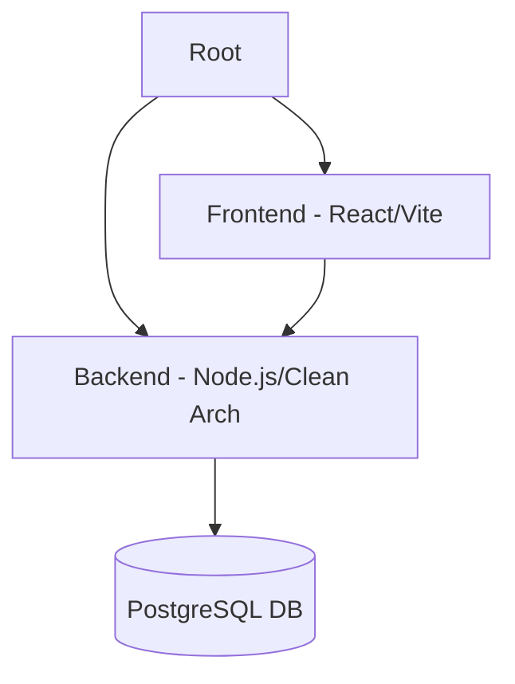

<p align="center">
  
</p>

<p align="center">
  <a href="#-sobre">Sobre</a> •
  <a href="#-funcionalidades">Funcionalidades</a> •
  <a href="#-tecnologias">Tecnologias</a> •
  <a href="#-estrutura">Estrutura</a> •
  <a href="#-guia-de-uso">Guia de Uso</a>
</p>

<p align="center">
  
  
  
</p>

---

## 📝 Sobre

O **Imuniza** é uma plataforma inteligente focada na **gestão, rastreabilidade e otimização** do estoque de vacinas. Desenvolvido para unidades de saúde, o sistema atua na prevenção ativa contra desperdícios, garantindo que cada frasco seja utilizado em seu potencial máximo e que todas as movimentações sejam auditáveis.

---

## ✨ Funcionalidades

| 🛡️ Segurança | 📊 Gestão | 🚀 Agilidade |
| :--- | :--- | :--- |
| **Alerta Anti-Desperdício**: Impede abertura de frascos redundantes. | **Rastreabilidade**: Ciclo de vida completo do lote ao descarte. | **Bulk Operations**: Processamento em massa para campanhas. |
| **Auditoria**: Log imutável de todas as ações no sistema. | **Transferências**: Movimentação segura entre unidades de saúde. | **Interface Intuitiva**: Dashboard focado na produtividade do técnico. |

---

## 🛠 Tecnologias

<table>
  <tr>
    <td align="center" width="120">
      
      <br>Node.js
    </td>
    <td align="center" width="120">
      
      <br>React 19
    </td>
    <td align="center" width="120">
      
      <br>TypeScript
    </td>
    <td align="center" width="120">
      
      <br>PostgreSQL
    </td>
    <td align="center" width="120">
      
      <br>Tailwind
    </td>
  </tr>
</table>

---

## 📂 Estrutura do Ecossistema



- 📂 **[backend](./backend)**: API robusta com Clean Architecture e Swagger.
- 📂 **[frontend](./frontend)**: Portal do usuário moderno com React 19 e shadcn/ui.

---

## 🚀 Guia de Uso

### 🗄️ 1. Banco de Dados
Execute os scripts SQL localizados em `backend/database/` na ordem numérica.

### ⚙️ 2. Backend
```bash
cd backend
npm install
npm run dev
```

### 🖥️ 3. Frontend
```bash
cd frontend
npm install
npm run dev
```

---

<p align="center">
  
  <br>
  Desenvolvido com ❤️ para a saúde pública.
</p>
